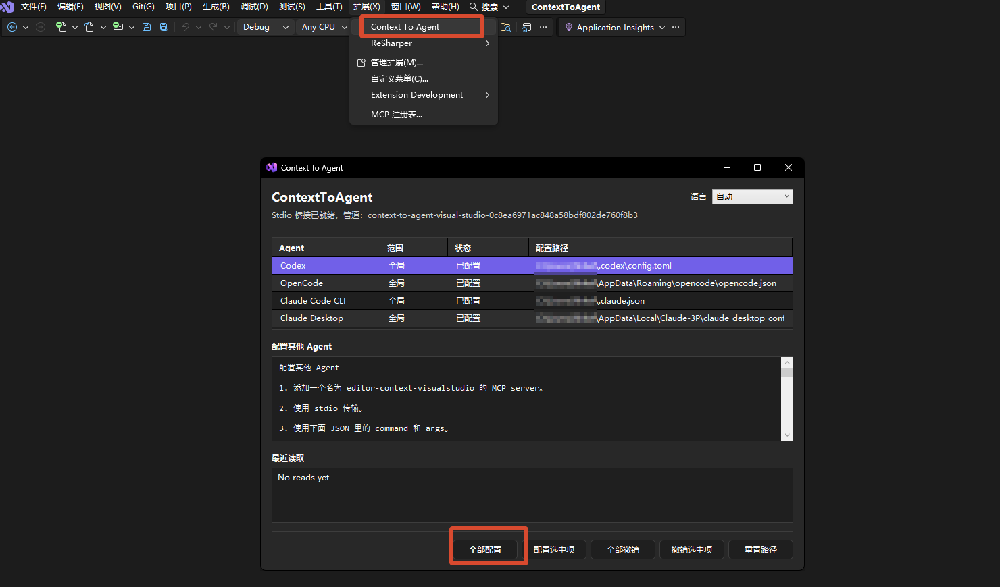
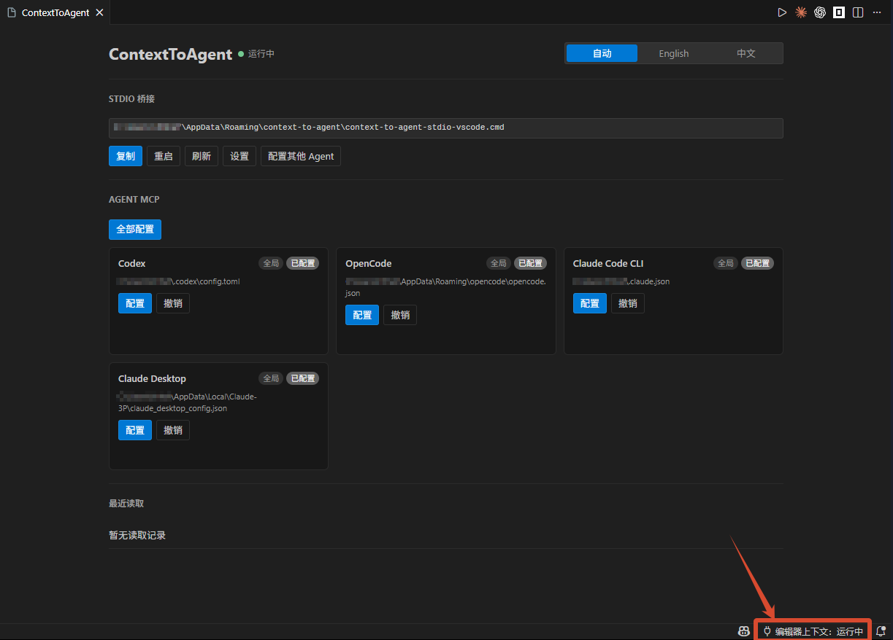
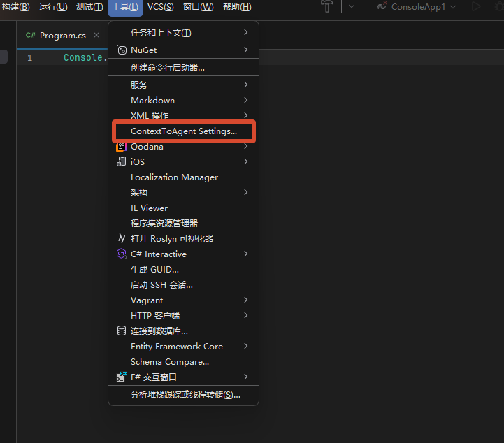

# ContextToAgent — Documentation

## Architecture

ContextToAgent uses stdio MCP as the only agent-facing transport. Editor plugins expose editor state through a plugin-local IPC socket/pipe while the editor is open.

### Components

**VS Code Extension** — Collects current editor state through VS Code APIs and hosts a plugin-local IPC server. The IPC server is not a public MCP endpoint; it is only used by the bundled stdio adapter. The extension writes a registry file under the user's application data directory so stdio adapters can find the active IPC endpoint.

**Stdio Adapter** — The bundled `stdioAdapter.js` is the MCP server process configured in agents. Agents start it with `command` and `args`; it reads JSON-RPC from stdin, forwards requests to the VS Code IPC endpoint, and writes JSON-RPC responses to stdout. The adapter exits with the agent process. It does not install a daemon and does not start VS Code.

**Visual Studio VSIX** — Follows the same stdio-first direction. Exposes editor state through a Windows named pipe and configures agents to launch the bundled `stdioAdapter.ps1`.

**JetBrains Plugin** — Follows the same stdio-first direction for IntelliJ Platform IDEs. Exposes editor state through plugin-local loopback IPC with a per-run token and configures agents to launch the bundled JVM `StdioAdapter` through a generated launcher.

**Agent Configuration** — All supported agents are configured with stdio. Each editor writes a distinct MCP server name so multiple editor plugins can coexist in the same agent config:

- VS Code: `editor-context-vscode`
- Visual Studio: `editor-context-visualstudio`
- JetBrains IDEs: `editor-context-jetbrains`
- Codex: `command` and `args` in `[mcp_servers.<server-name>]`
- OpenCode: `{ "type": "local", "command": [...] }`
- Claude Code CLI: user-global `~/.claude.json` with `{ "type": "stdio", "command": "...", "args": [...] }`
- Claude Desktop: `{ "command": "...", "args": [...] }`

### Data Flow

```text
Agent
  -> stdio adapter
  -> editor plugin IPC server
  -> editor API snapshot
  -> MCP tool result
```

No shared background service is installed. If the editor closes, the adapter returns a clear unavailable error.

### Context Selection

The plugin-local IPC endpoint only exposes the editor instance that owns it. `list_instances`, `set_preferred_instance`, and `clear_preferred_instance` remain for compatibility, but v1 does not need cross-editor arbitration.

If a user has VS Code, Visual Studio, and JetBrains plugins installed, each editor owns its own IPC endpoint. The active adapter selects the endpoint recorded by that editor plugin.

### Privacy Boundary

No workspace search, no file snapshots, no active file full text, no git diff, no writes, and no command execution. Empty selections return cursor/path only; selected text is returned only when the user selected text.

---

## Protocol

Agents talk to ContextToAgent through stdio MCP. The bundled stdio adapter reads newline-delimited JSON-RPC messages from stdin and writes newline-delimited JSON-RPC responses to stdout.

The adapter forwards MCP requests to the active editor plugin over plugin-local IPC. The IPC channel uses the same newline-delimited JSON-RPC payloads and is discovered through the registry file written by the editor plugin.

Supported MCP methods: `initialize`, `ping`, `tools/list`, `tools/call`.

MCP tools: `list_instances`, `get_context`, `set_preferred_instance`, `clear_preferred_instance`.

`get_context` returns: `schemaVersion`, `status`, `instance`, `workspaceRoots`, `activeWorkspaceRoot`, `activeFile`, `cursor`, `selection`, `errors`.

The bridge returns selected text only when the user has an active selection. It never returns the active file body, nearby code, workspace search results, git state, or command output.

JSON schemas live in `schemas/`.

---

## Usage Tutorial

**Visual Studio：**



**Visual Studio Code：**



**JetBrains：**



----

## Packaging

There is no companion service binary to publish. Package only the editor plugins.

The repository ships a single script that packages all editor plugins:

```powershell
npm run package
```

This runs the verification step, then builds the Visual Studio VSIX, the VS Code VSIX, and the JetBrains plugin ZIP into `artifacts/`. Use the switches to skip any side:

```powershell
powershell -ExecutionPolicy Bypass -File scripts\package-extensions.ps1 -SkipVisualStudio
powershell -ExecutionPolicy Bypass -File scripts\package-extensions.ps1 -SkipVSCode
powershell -ExecutionPolicy Bypass -File scripts\package-extensions.ps1 -SkipJetBrains
powershell -ExecutionPolicy Bypass -File scripts\package-extensions.ps1 -SkipVerify
```

The named artifacts are:

```text
artifacts\ContextToAgent-visualstudio-<version>.vsix
artifacts\ContextToAgent-vscode-<version>.vsix
artifacts\ContextToAgent-jetbrains-<version>.zip
```

### Visual Studio VSIX

The Visual Studio extension project lives in `extensions/visualstudio` and the project file is `ContextToAgent.csproj`.

Prerequisites:

- Windows
- .NET SDK
- Visual Studio SDK build tools restored from NuGet, or a Visual Studio installation with the extension development workload

Prefer the unified script. To build the Visual Studio VSIX manually, from the repository root:

```powershell
dotnet restore .\extensions\visualstudio\ContextToAgent.csproj

$projDir = Resolve-Path .\extensions\visualstudio
$vssdk = Get-ChildItem "$env:USERPROFILE\.nuget\packages\microsoft.vssdk.buildtools" -Directory |
  Sort-Object { [version]$_.Name } -Descending |
  Select-Object -First 1
$vstools = Join-Path $vssdk.FullName "tools"
$int = Join-Path $projDir "obj\Release\net472\"
$out = Join-Path $projDir "bin\Release\net472\"
$dll = Join-Path $out "ContextToAgent.VisualStudio.dll"

dotnet msbuild "$projDir\ContextToAgent.csproj" `
  '/t:Build;GeneratePkgDef;CreateVsixContainer' `
  /p:Configuration=Release `
  /p:VSToolsPath="$vstools" `
  /p:IntermediateOutputPath="$int" `
  /p:OutputPath="$out" `
  /p:OutDir="$out" `
  /p:CreatePkgDefAssemblyToProcess="$dll" `
  /p:TargetVsixContainer="$out\ContextToAgent.vsix" `
  /p:DeployExtension=false
```

The output is:

```text
extensions\visualstudio\bin\Release\net472\ContextToAgent.vsix
```

To install it manually, double-click the VSIX or use Visual Studio's extension installer. Close running Visual Studio instances before upgrading the extension.

After installation, restart Visual Studio and open the standalone UI from `Extensions > ContextToAgent > Settings...`. The options page is available from `Tools > Options > ContextToAgent > General`. The command is also registered as `ContextToAgent.OpenSettings` for Visual Studio command search. Visual Studio 2022/2026 reparent extension top-level menus into `Extensions`; this VSIX uses that official menu path for reliable visibility.

If building from the Visual Studio IDE, open `ContextToAgent.csproj`, choose `Release`, and build the project. If the IDE build does not create the VSIX, use the command-line packaging flow above.

### VS Code VSIX

The VS Code extension project lives in `extensions/vscode`.

Prerequisites:

- Node.js and npm
- `@vscode/vsce`, installed globally or run through `npx`

Prefer the unified script. To build the VS Code VSIX manually, from the repository root:

```powershell
npm run verify
cd .\extensions\vscode
npx @vscode/vsce package
```

The output is:

```text
extensions\vscode\context-to-agent-0.1.15.vsix
```

To install it locally:

```powershell
code --install-extension .\context-to-agent-0.1.15.vsix
```

The VS Code extension is JavaScript and runs cross-platform as long as the target VS Code version supports the extension API.

### JetBrains Plugin

The JetBrains plugin project lives in `extensions/jetbrains` and is implemented in Kotlin for IntelliJ Platform IDEs. It targets JetBrains IDEs 2024.3+ (`since-build=243`) and emits Java 21-compatible bytecode.

Prerequisites:

- JDK 21+
- Gradle, or an IDE/CI image with Gradle available

Prefer the unified script. To build the JetBrains plugin manually:

```powershell
cd .\extensions\jetbrains
gradle buildPlugin
```

The output ZIP is under:

```text
extensions\jetbrains\build\distributions
```

Install it from `Settings > Plugins > Install Plugin from Disk...`, then restart the IDE. Open `Tools > ContextToAgent Settings...` or `Settings > Tools > ContextToAgent` to configure Agent MCP entries. The JetBrains bridge uses the same MCP tool contract as the VS Code and Visual Studio plugins, with its own `editor-context-jetbrains` server name.

### Agent Configuration

Use the VS Code status bar dashboard or the Visual Studio settings dialog for one-click stdio configuration where supported. Both surfaces support English/Chinese UI switching and per-agent config path overrides. For other agents, use the Configure Other Agents guide or the examples in `examples/`.

---

## Testing

```sh
npm run verify
```

Automated checks run the project verification script and the VS Code agent-config unit tests.

Manual checks:

- Open VS Code with the extension loaded.
- Confirm the status bar shows ContextToAgent status.
- Open the ContextToAgent dashboard from the status bar or command palette.
- Switch the dashboard language between English and Chinese.
- Configure Codex, OpenCode, Claude Code CLI, or Claude Desktop MCP through the dashboard.
- Confirm the native VS Code settings command opens `@ext:local.context-to-agent`.
- Ask the Agent to call `editor-context-vscode.get_context`.
- Verify empty selections return path and cursor only.
- Verify selected text returns exactly the selected text.
- Verify diagnostics contain only error-level entries and are capped at 50.

Visual Studio VSIX checks must run on Windows with the Visual Studio SDK installed.

JetBrains checks must run in a JetBrains IDE sandbox or installed IDE. Verify the settings page opens, the generated launcher is copied into Agent config, empty selections omit text, selected text is returned exactly, and error highlights are capped at 50.

## License

ContextToAgent is licensed under the Apache License 2.0.


```
Finally, thank you. LinuxDo，The community’s open-source environment!!
```
